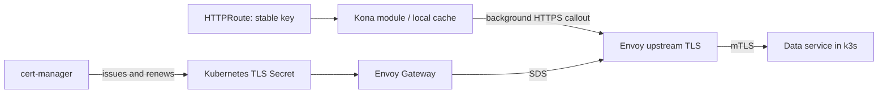

# Kona

[](https://github.com/dio/kona/actions/workflows/ci.yaml)

A small Envoy Go dynamic-module spike: route configuration selects a key; independently
refreshed application data supplies its value. Remote data travels over mTLS owned by
Envoy, using an upstream cluster and client credentials configured by Envoy Gateway.



The module uses the Envoy 1.38 Go SDK's **config-context HTTP callout**. It never reads
private keys. The default integration-test mode uses cert-manager to create a disposable application CA and issue
separate server and client certificates. EG's internal control-plane identity is not reused.
The server requires a trusted client certificate with URI SAN `spiffe://kona.test/gateway`.

The alternate `KONA_ISSUER=certgen` pathway bootstraps self-signed PKI without
cert-manager. See [certificate issuance, trust, rotation and cgo settings](docs/certificates.md)
for the exact differences.

The chart defaults to `pki.mode=certgen` for bootstrap without another controller.
Install EG first, then the [Kona Helm chart](charts/kona); see the
[installation guide](docs/helm.md). Both issuer modes support the tested
[A -> A+B -> B rollover procedure](docs/ca-rollover.md).

## Sources

Exactly one source is selected in filter configuration:

```json
{"source":{"inline":{"demo":{"message":"hello"}}}}
```

```json
{"source":{"filename":"/mounted/data.json"},"poll_ms":500,"max_age_ms":3000}
```

```json
{"source":{"remote":{"cluster":"httproute/default/kona-app/rule/0","authority":"kona-data.default.svc.cluster.local","path":"/data"}},"poll_ms":500,"max_age_ms":3000}
```

Inline values are JSON bytes. Files are reopened on every poll, including after atomic
replacement of projected Kubernetes volumes. Remote HTTPS uses the EG-generated named
cluster. The document is an object mapping keys to arbitrary JSON values, bounded to 1 MiB.
The route carries `metadata.filter_metadata.kona.key: demo`; the module returns that
value as a demonstration. Missing, invalid-at-startup or stale data yields HTTP 503.
Invalid refreshes preserve the last valid value only until its freshness deadline.

The spike implements HTTPS polling, not gRPC/ConnectRPC or a delta protocol. Those need
additional source adapters. File and inline sources have local coverage; the live lane
qualifies HTTPS. Polling currently replaces one document; the interface does not require
all application data to be one global snapshot.

## Run

For a machine with no cluster or prebuilt images, follow the
[manual local walkthrough](docs/local-walkthrough.md). It includes tool installation,
EG and Kona setup, both issuer modes, data updates, mTLS checks, and cleanup.

Requires Go 1.27.1+, Docker, k3d, kubectl and Helm. Images build for the local architecture.
The Go SDK is pinned to the same commit as Envoy v1.38.0. Keep these pins together.
The fixture sets `GODEBUG=cgocheck=0`, required by this SDK version; see the
[SDK limitation](docs/design.md).

```sh
make test
make integration
```

The live test uses `github.com/dio/egtest` to own a disposable k3s `v1.33.13-k3s2` cluster
with EG `v1.9.1`. It installs a checksum-verified cert-manager `v1.21.2` manifest, imports
local images, and automatically removes the cluster and port-forwards when finished.
It never changes the user's current Kubernetes context. Images remain for reuse.

Live assertions cover:

- Native module loaded and returning data from the deployed mTLS service.
- Active Envoy upstream client-certificate SDS configuration.
- Data changes without changing HTTPRoute configuration.
- Direct service rejection of absent and untrusted certificates and unauthorized identities.
- cert-manager reissuance reaching the server via EG/SDS without replacing the Envoy pod.
- Stale data failure and recovery.
- Helm install and idempotent upgrade, overlapping CA trust, leaf migration, old-root
  rejection, and continued sampled application availability without pod restarts.

The client rotation test deletes the client Secret to force cert-manager reissuance;
it does not wait for scheduled renewal. The server deliberately closes connections to
observe new handshakes promptly. Long-lived stream draining and production
issuer integration are outside this spike. The in-memory data service and loopback-only mutation port
are test fixtures, not a production data service.

See [design](docs/design.md), [certificate pathways](docs/certificates.md),
[validated results and limits](docs/validation.md), and [integration fixtures](integration/testdata).

## CI

Pushes and pull requests run Go formatting, race tests, vet, native Linux Docker builds
for both images, and Helm lint, rendering for both issuer modes, and packaging.
CI does not run the live k3d mTLS/rollover fixture; use `make integration` for that lane.
No images or chart releases are published by CI.

## Single-Envoy native tests (no Docker)

`make native-test ENVOY_BIN=/path/to/envoy` builds a host-native module and runs Go
integration tests against one local Envoy process. The host binary must match
the Envoy 1.38 SDK revision in `go.mod` (`f1dd21b16c24`). All build and test lanes
use the same module dependencies.

The reusable [`envoytest`](envoytest) runner follows Transit's process-test pattern.
Tests own in-process HTTP/TLS fixtures; the runner owns Envoy startup, readiness,
logs and cleanup. See [native testing requirements](docs/native-testing.md).
